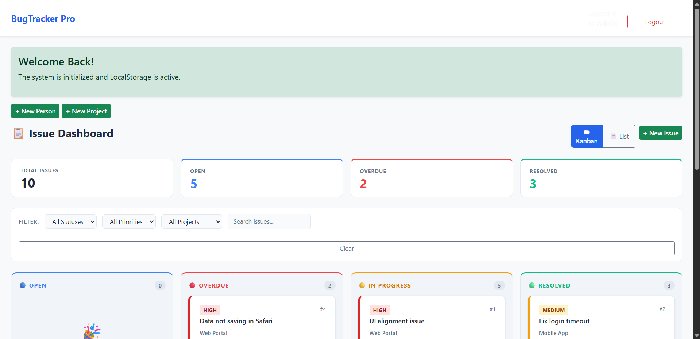
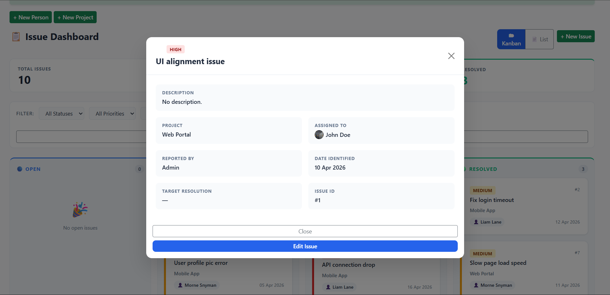
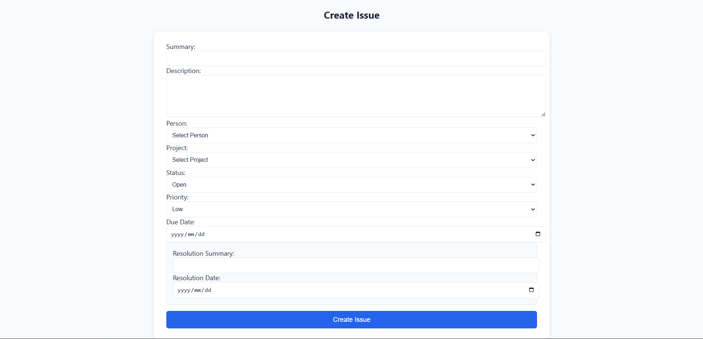
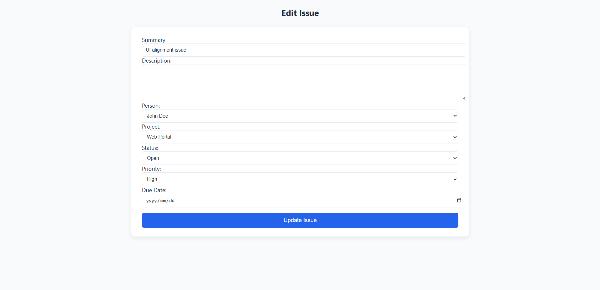

````md
# Bug Tracking System (BTS)

[](https://img.shields.io/)
[](https://img.shields.io/)
[](https://img.shields.io/)
[](https://img.shields.io/)
[](https://img.shields.io/)

## Project Overview

The Bug Tracking System (BTS) is a browser-based issue tracking application designed to simulate a real-world bug management workflow. It allows users to create, edit, assign, filter, and resolve issues while linking them to people and projects.

The system was built entirely with frontend technologies and browser storage, making it lightweight, portable, and easy to run without any backend setup.

## Purpose

This project was created to demonstrate:

- Frontend application structure
- Data handling with localStorage
- Dynamic UI rendering
- Form-driven workflows
- State updates across multiple pages
- Dashboard-style issue management

## Key Features

### Issue Management
- Create new issues
- Edit existing issues
- View issue details in a modal
- Assign issues to users
- Link issues to projects
- Store resolution details for completed issues

### Dashboard
- Kanban-style board
- List view with sorting
- Filtering by status, priority, project, and search term
- Issue counts and status summaries
- Automatic overdue detection

### People and Project Management
- Add new people
- Add new projects
- Manage component values dynamically
- Match issues to assigned users and projects

### User Experience
- Modal-based issue inspection
- Page navigation for editing
- Automatic dashboard refresh after updates
- Responsive layout

## Screenshots

### Dashboard


### Issue Details Modal


### Create Issue Page


### Edit Issue Page


## Tech Stack

- HTML5
- CSS3
- JavaScript
- Bootstrap 5
- Browser localStorage

## Project Structure

```text
project-folder/
├── index.html
├── IssueCreation.html
├── editissue.html
├── storage.js
├── PeopleProjects.js
├── style.css
└── assets/
    ├── dashboard.png
    ├── issue-modal.png
    ├── create-issue.png
    └── edit-issue.png
````

## How It Works

### Authentication

The dashboard uses a simple admin login stored in localStorage.

Login credentials:

* Username: admin
* Password: admin123

### Data Storage

All system data is stored in browser localStorage:

* `bts_issues`
* `bts_people`
* `bts_projects`
* `bts_admin_logged_in`

### Issue Flow

1. A user creates a new issue
2. The issue is saved to localStorage
3. The dashboard loads the issue dynamically
4. Clicking an issue opens a modal
5. The user can edit the issue from the modal
6. Changes are saved and reflected on the dashboard

### Status Logic

Issues can move through the following states:

* Open
* In Progress
* Overdue
* Resolved

An issue becomes overdue when its due date has passed and it has not been marked as resolved.

## Data Models

### Issue Object

```json
{
  "id": 1,
  "summary": "UI alignment issue",
  "description": "The button is not aligned correctly on mobile view.",
  "assignedTo": "msnyman",
  "project": "Web Portal",
  "status": "open",
  "priority": "high",
  "dueDate": "2026-04-22",
  "resolutionSummary": "",
  "resolutionDate": "",
  "date": "2026-04-20"
}
```

### Person Object

```json
{
  "id": 1,
  "username": "msnyman",
  "name": "Morne",
  "surname": "Snyman",
  "email": "morne@email.com",
  "profilePicture": ""
}
```

### Project Object

```json
{
  "id": 1,
  "name": "Web Portal"
}
```

## File Responsibilities

### index.html

Main dashboard page containing:

* Kanban board
* List view
* Filters
* Issue modal
* Navigation to create and edit issue pages
* Navigation to create and users and projects

### IssueCreation.html

Used to:

* Create a new issue
* Load people and project dropdowns
* Validate and save issue data

### editissue.html

Used to:

* Load an existing issue
* Prepopulate the form
* Update issue details
* Save changes back to localStorage

### storage.js

Handles:

* LocalStorage access
* Default data initialization
* Login state
* Shared BTS data functions

### PeopleProjects.js

Handles:

* Adding people
* Adding projects
* Populating dropdowns
* Keeping dropdown values in sync with stored data

### style.css

Contains:

* Layout styling
* Dashboard styling
* Modal styling
* Form styling
* Responsive adjustments

## Design Decisions

* localStorage was used to keep the project backend free and easy to run
* Bootstrap was used to speed up responsive layout and modal implementation
* A kanban board was chosen to make issue status easy to understand visually
* Separate pages were used for creation and editing to keep workflows clear
* Dynamic dropdowns were implemented to keep issue assignment linked to stored people and projects

## Strengths of the Project

* Clean workflow from creation to resolution
* Persistent data without a backend
* Modular JavaScript structure
* Dynamic dashboard rendering
* Clear separation between people, projects, and issues
* Practical simulation of a bug tracking system

## Limitations

* Data is stored only in the browser
* No server-side authentication
* No multi-user synchronization
* No database persistence
* Limited reporting and analytics

## Future Improvements

* Add backend support
* Implement user roles and permissions
* Add drag-and-drop issue movement
* Include search and reporting dashboards
* Add real-time collaboration
* Store data in a database instead of localStorage

## Setup Instructions

1. Download or clone the project
2. Open `index.html` in a browser
3. Log in using the admin credentials
4. Navigate through the dashboard to manage issues, people, and projects

## Admin Login

* Username: `admin`
* Password: `admin123`

## Summary

The Bug Tracking System is a frontend issue management application that demonstrates practical knowledge of HTML, CSS, JavaScript, and browser storage. It provides a complete issue workflow including issue creation, editing, assignment, filtering, and status tracking in a clean dashboard interface.

Author

Frontend development project demonstrating CRUD operations, UI design, and state management using vanilla JavaScript.

License

This project is intended for educational and portfolio purposes.